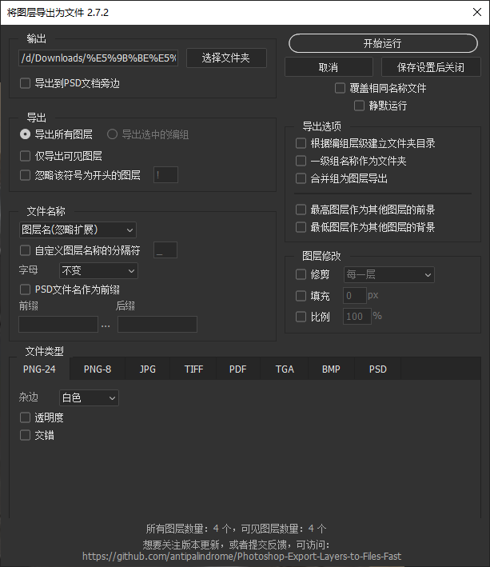

# [点击前往原作者链接](https://github.com/antipalindrome/Photoshop-Export-Layers-to-Files-Fast)

## 此复刻仓库更新内容

1. 界面汉化。
2. 新增了一个选项，可以将原始PSD文件名作为导出/分层文件的前缀保留。该功能可通过界面中的复选框进行开启或关闭。

### 脚本别名

- 将图层导出为文件
- 快速将图层导出为文件
- 批量导出每一层图层脚本
- Photoshop Export Layers to Files Fast简体中文
- Photoshop Export Layers to Files Fast汉化

# Photoshop将图层导出为文件

这个脚本可以将你的 Photoshop 文档中的图层导出为单独的文件，比 Adobe 内置脚本的速度要快得多。

该脚本并不试图实现与内置脚本的功能完全一致，而是致力于提供更流畅和高效的体验。当然，你可以随时提出功能请求，也欢迎贡献代码，让它变得更加强大！

## 目录

- [使用方法](#使用方法)
- [示例截图](#示例截图)
- [功能特色](#功能特色)
- [附加字段说明](#附加字段说明)
- [批量处理/动作](#批量处理动作)
- [使用要求](#使用要求)
- [贡献指南](#贡献指南)
- [反馈/报告错误](#反馈报告错误)

## 使用方法

_免责声明：_ 本项目与 Adobe 无任何关联。如遇到任何与 Adobe 产品或脚本相关的问题，请直接联系 Adobe。虽然我们从未遇到问题，但**请自行承担使用本脚本的风险**。我们对任何数据丢失或 PSD 损坏不承担责任，因此请务必备份你的文件。

- 前往[原作者发布页面](https://github.com/antipalindrome/Photoshop-Export-Layers-to-Files-Fast/releases)下载[最新版本(英文)](https://github.com/antipalindrome/Photoshop-Export-Layers-to-Files-Fast/releases/latest)。
- 在 Photoshop 中，依次点击 `文件 -> 脚本 -> 浏览...`，然后选择 `将图层导出为文件.jsx` 文件。
  - 注意：脚本运行时需要 `Export Layers To Files (Fast)-progress_bar.json` 文件。否则会出现“进度条资源损坏”的错误。请确保 `.jsx` 和 `.json` 文件位于同一目录下。
- 你也可以把脚本添加到 Photoshop 的脚本菜单中，只需将所有脚本文件复制到 `Photoshop > Presets > Scripts` 文件夹。
  - Windows: `/Program Files/Adobe/Adobe Photoshop 版本号/Presets/Scripts`
  - Mac: `/Applications/Adobe Photoshop 版本号/Presets/Scripts`

## 示例截图

## 功能特色

部分功能包括...

- 支持导出格式：
  - PNG（8位和24位）
  - JPEG
  - TIFF
  - PDF
  - Targa
  - BMP
  - PSD
- 支持分组图层嵌套
- 支持导出所有图层或仅导出可见图层
- 文件命名方式灵活：可使用图层名、图层+组名或自动编号
- 最底层图层可作为公共背景处理
- 导出的图像可以是图层大小或画布大小（裁剪选项）
- 自动记忆上次使用的设置
- 可仅导出选中的组，其他内容保持不变（适用于复杂背景和前景中可变内容的批量导出）
- 支持按组创建文件夹结构，遇到同名文件夹时自动重命名

## 附加字段说明

### 选中组

只导出你在运行脚本前选中的组。注意，如果未提前选中组，此选项将被禁用。以这种方式运行脚本时，其他所有图层将保持不变，因此导出时可能会包含上下方的可见图层内容。

### 忽略指定前缀图层

启用此选项后，你可以输入一个前缀，所有以该前缀命名的图层将在导出时被忽略。

例如，如果你输入 `x`，那么所有以 `x` 开头的图层将不会被导出。

### 文件命名

| 选项            | 示例                                           |
|:------------- |:-------------------------------------------- |
| 使用图层名称（去除扩展名） | `layer-3.png` => `layer-3.png`               |
| 使用图层名称（保留扩展名） | `layer-3.png` => `layer-3.png.png`           |
| 使用图层+组名       | `group 1 > layer-3` => `group-1-layer-3.png` |
| 按索引递减命名       | 顶层 `layer-10` => `01`                        |
| 按索引递增命名       | 顶层 `layer-5` => `5`                          |

### 使用自定义分隔符

启用 `使用自定义分隔符` 后，可以用自定义字符替代文件名中的空格。由于 Photoshop 不支持文件名中包含空格，因此默认使用 `-`。

例如：
`my layer 1` 将导出为 `my-layer-1`

以下字符**不允许**作为分隔符使用：
`\`、`/`、`*`、`?`、`|`、`.`、`:`、`"`、`<`、`>`、`%`、`,`、`;`、`=`

### 前缀/后缀

可以为每个导出的文件名添加自定义前缀或后缀，且与所有命名方式兼容。

前缀/后缀中禁止使用以下字符：
`\`、`/`、`*`、`?`、`|`、`:`、`"`、`<`、`>`

| 前缀        | 后缀           | 输出示例                         |
|:--------- |:------------ |:---------------------------- |
| `test-`   | 无            | `test-layer-3.png`           |
| 无         | `.scale-100` | `layer-3.scale-100.png`      |
| `test-`   | `.scale-100` | `test-layer-3.scale-100.png` |
| `{ii}-`   | 无            | `04-layer-3.png`             |
| `{YYYY}-` | 无            | `2021-layer-3.png`           |

#### 变量替换

前缀和后缀支持如下变量：

| 变量       | 示例            |
|:-------- |:------------- |
| `{i}`    | 当前图层索引        |
| `{ii}`   | 当前图层索引，1位数补0  |
| `{iii}`  | 当前图层索引，最多补两位0 |
| `{iiii}` | 当前图层索引，最多补三位0 |
| `{ln}`   | 当前图层名称        |
| `{dn}`   | 当前文档名称        |
| `{M}`    | 月份            |
| `{MM}`   | 月份（补零）        |
| `{D}`    | 日期            |
| `{DD}`   | 日期（补零）        |
| `{YY}`   | 年（后两位）        |
| `{YYYY}` | 年（四位数）        |
| `{HH}`   | 小时（补零）        |
| `{mm}`   | 分钟（补零）        |
| `{ss}`   | 秒钟（补零）        |
| `{sss}`  | 毫秒（补零）        |

### 已知问题

- 目前暂不支持导出多画板（Multiple Artboards）

## 批量处理/动作

许多人喜欢配置好脚本设置后，通过批处理或动作自动运行脚本。

操作步骤：

1. 第一次运行脚本，设置好对话框中的选项，然后点击“保存并关闭”；
2. 打开脚本文件，使用文本编辑器（如 Mac 的 TextEdit、Windows 的记事本或代码 IDE）；
3. 在脚本顶部找到 `var BATCH_OPERATION = false;` 这一行；
4. 修改为 `var BATCH_OPERATION = true;`；
5. 再次运行脚本时，将直接使用上次保存的设置自动执行，无需弹出对话框。

如果需要重新设置参数，只需将 `BATCH_OPERATION` 改回 `false` 后再运行脚本即可。

## 使用要求

我们尽力保证脚本向下兼容（支持到 Photoshop CS2），但测试环境受限于 Photoshop 版本和操作系统版本。如果遇到问题，请尝试下载[旧版本脚本](https://github.com/antipalindrome/Photoshop-Export-Layers-to-Files-Fast/releases)进行使用。

## 贡献指南

欢迎大家贡献代码！非常感谢！

注意事项：

- 更新对话框 UI 时，请参考 `dev/dialog.js`，并使用 https://scriptui.joonas.me/ 导入编辑。完成后导出代码，把顶部注释块复制到 `dev/dialog.js`，其余部分复制到 `Export Layers To Files (Fast).jsx` 中的 `showDialog` 函数。
- 新增的任何 UI 元素必须支持设置记忆，即用户勾选或填写后，下次打开脚本时保留。

## 反馈/报告错误

请通过 GitHub 的问题反馈(issues)页面提交反馈、建议或 bug 报告。

反馈时请附上以下信息：

- 你的操作系统及版本
- 你的 Photoshop 版本及具体版本号
- 截图（如果适用）
- 可以重现问题的 `.psd` 文件（越简单越好）
